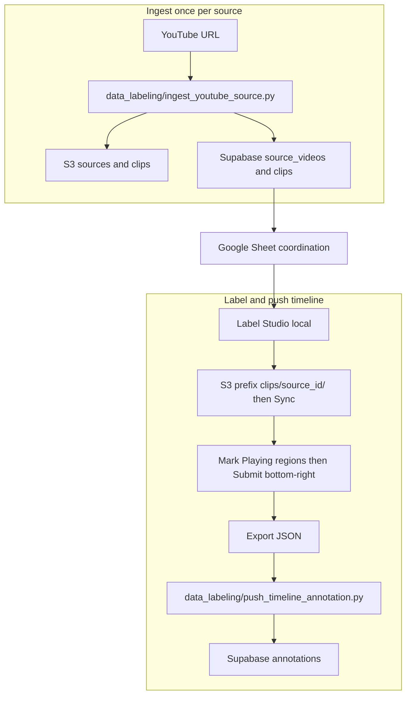

# Workflow overview

End-to-end flow: **YouTube → clips on S3 + DB → Label Studio → annotations in DB.** Doc index: [README](README.md). Narrative architecture: [annotation_schema_and_systems.md](annotation_schema_and_systems.md). Executable SQL only: [schema.md](../schema.md).

## One-time setup

1. **Machine tools:** `brew install yt-dlp ffmpeg` (or equivalent).
2. **Python:** repo root → create a venv, then `pip install -e .` (uses [pyproject.toml](../../pyproject.toml) for boto3, supabase, dotenv, etc.).
3. **`.env`:** copy the template file shared on **WhatsApp** into `.env` in the repo root and fill in values (shared AWS + Supabase credentials, your personal **`ANNOTATOR_NAME`**, etc.). `data_labeling/ingest_youtube_source.py` and `data_labeling/push_timeline_annotation.py` both read it via `python-dotenv`.
4. **Label Studio:** follow [label-studio-setup.md](label-studio-setup.md) (venv, project XML, S3 storage with prefix `clips/{source_id}/`). High-level layout and credentials: [annotation_schema_and_systems.md](annotation_schema_and_systems.md).

Supabase **tables already exist** for this project — no SQL bootstrap step for collaborators.

## Label a new source (repeat per video)

1. **Ingest:** from repo root, run `python data_labeling/ingest_youtube_source.py '<youtube_url>' --display-name 'Human title'`. That downloads, segments to 60 s / 30 fps clips, uploads to S3, upserts `source_videos` and `clips`, then removes `./workdir/{id}/`.
2. **Google Sheet:** add a row (Source ID = YouTube id, display name, status **Available** — or your team’s convention).
3. **Claim** the row if someone else will label it; set status as your team defines.
4. **Label Studio:** set S3 source **prefix** to `clips/{source_id}/`, **Sync** tasks. Open each task and mark **Playing** only (timeline regions where the ball is in play). **Anything you do not label is treated as downtime** — you do not need separate Downtime regions. When finished with a task, press **Submit** in the **bottom-right** of the labeling UI (submitted tasks are what the JSON export includes).
5. **Export:** Data Manager → **Export** → format **JSON** (full common format), save the file. The exported task data must contain S3-backed clip refs such as `data.video = s3://sports-footage-autotrim-bucket/clips/{source_id}/{source_id}_001.mp4` or the equivalent S3 HTTPS URL. If you see `/data/upload/...`, the task came from a local Label Studio upload instead of S3 sync and should be recreated from Cloud Storage.
6. **Push:** `python data_labeling/push_annotations.py /path/to/export.json` (optional `--dry-run` first). Requires `.env` Supabase + `ANNOTATOR_NAME`. Inserts one row per task per annotator (skips duplicates already in DB). See W3 in [annotation_schema_and_systems.md](annotation_schema_and_systems.md).
7. **Google Sheet:** mark **Done** (and dates) when finished.

## Flow diagram

Manual **Google Sheet** updates (after ingest, after timeline push) keep a lightweight human ledger alongside automation.
