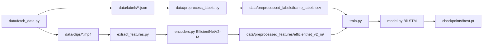

# LSTM playing / inactive classifier

Frame-level binary classifier: **playing (active)** vs **inactive** on volleyball clips. A frozen **EfficientNetV2-M** encodes each video frame once; a small **BiLSTM** reads a 1-second window of those features and predicts the label at the center frame.

Upstream labeling and ingest live under [`data/`](../../data/) and [`data_labeling/`](../../data_labeling/). This folder is the modeling stack only.

---

## Pipeline overview



**Run order (from repo root, venv active):**

```bash
# 1. Download clips + Label Studio JSON (once per source)
python data/fetch_data.py

# 2. Per-frame labels CSV (after annotation changes)
python data/preprocess_labels.py

# 3. Cache CNN embeddings (after new clips or backbone / resolution change)
python models/lstm/extract_features.py --device mps --batch-size 32

# 4. Train temporal head
python models/lstm/train.py --device mps --epochs 10

# Quick smoke run
python models/lstm/train.py --device mps --epochs 2 --batch-size 64
```

---

## Data layout

| Path | Role |
|------|------|
| `data/clips/<source_id>/<clip_id>.mp4` | Raw ~1800-frame (30 FPS) clips |
| `data/labels/<source_id>/<clip_id>.json` | Label Studio exports from `fetch_data.py` |
| `data/preprocessed_labels/frame_labels.csv` | One row per frame: `clip_id`, `frame_idx`, `is_playing` |
| `data/preprocessed_labels/meta.json` | Per-clip frame counts and paths |
| `data/preprocessed_features/efficientnet_v2_m/<clip_id>.pt` | Cached `(num_frames, 1280)` features per clip |
| `data/preprocessed_features/efficientnet_v2_m/meta.json` | Backbone, `feat_dim`, `img_size` (480), device used |

Generated data dirs are gitignored.

---

## Module map

| File | Purpose |
|------|---------|
| [`encoders.py`](encoders.py) | Pluggable frame encoders; default **`efficientnet_v2_m`** at **480×480**, ImageNet normalize. Registry supports `efficientnet_v2_s` / `_l` for later experiments. |
| [`extract_features.py`](extract_features.py) | Decode each MP4, batch through encoder, write `.pt` + update feature `meta.json`. |
| [`dataset.py`](dataset.py) | `FeatureWindowDataset`: loads CSV labels + cached features; each sample is 30 consecutive feature vectors centered on target frame `T` (`T-15` … `T+14`), zero-padded at clip edges. |
| [`model.py`](model.py) | `TemporalPlayingClassifier`: BiLSTM (128 hidden, bidirectional) → linear logit for center frame. |
| [`train.py`](train.py) | Clip-level train/test split, weighted BCE, metrics, checkpoints. |
| [`predict.py`](predict.py) | *Not implemented yet* — will load `best.pt` + encoder for inference on new clips. |

---

## Feature extraction

**Script:** `extract_features.py`

- Reads clip list from `data/preprocessed_labels/frame_labels.csv`.
- **Input resolution:** 480×480 for `efficientnet_v2_m` (from torchvision `weights.transforms()`, not `meta["min_size"]`).
- **Device:** use GPU when available — on Apple Silicon: `--device mps`; NVIDIA: `--device cuda`. Defaults to best available if omitted.
- Skips clips whose `.pt` is newer than the MP4 unless `--force`.
- Shows tqdm at clip level and per-clip frame level.

```bash
python models/lstm/extract_features.py --device mps --batch-size 32
python models/lstm/extract_features.py --force   # re-encode everything
```

Each `.pt` file contains: `clip_id`, `backbone`, `feat_dim`, `img_size`, `num_frames`, `features` tensor.

---

## Training

**Script:** `train.py`

### Split

- **70% train / 30% test** at **`clip_id`** level (`random_seed=42`) so adjacent frames do not leak between splits.
- Split is written to [`checkpoints/train_config.json`](checkpoints/train_config.json) after each run.

### Model input / target

- **Input:** `(batch, 30, 1280)` feature window.
- **Target:** `is_playing` at the **center** frame (index 15 in the window).
- **Loss:** `BCEWithLogitsLoss` with `pos_weight = (neg/pos) * 4` to favor **recall** (missing “playing” is worse than extra false positives).

### Evaluation (printed each epoch on **test** clips)

Metrics are pooled over all frames in held-out clips:

| Metric | Meaning |
|--------|---------|
| **Recall** | TP / (TP + FN) — primary metric; checkpoint `best.pt` prefers higher recall, then lower cost |
| **Precision** | TP / (TP + FP) |
| **F1** | Harmonic mean of precision and recall |
| **Cost** | `5×FN + 1×FP` (weighted confusion summary) |
| **TP / FP / TN / FN** | Counts at threshold 0.5 |

Example log line:

```text
epoch 1: train_loss=0.42 test_loss=0.38 recall=0.85 precision=0.62 f1=0.72 cost=120 (TP=… FP=… TN=… FN=…)
```

With only ~5 test clips today, treat numbers as a **sanity check**, not a stable benchmark.

### CLI

```bash
python models/lstm/train.py --epochs 10 --batch-size 32 --device mps
```

| Flag | Default |
|------|---------|
| `--epochs` | `10` |
| `--batch-size` | `32` |
| `--device` | best available (`cuda` → `mps` → `cpu`) |

### Outputs

| File | Contents |
|------|----------|
| `checkpoints/best.pt` | Best test recall; includes `model_state`, `metrics`, `config` |
| `checkpoints/last.pt` | Final epoch |
| `checkpoints/train_config.json` | Backbone, paths, `train_clip_ids`, `test_clip_ids`, hyperparameters |

`train.py` refuses to start if feature cache `img_size` ≠ encoder expectation (e.g. old 33×33 caches).

---

## Dependencies

From repo root with venv activated:

```bash
pip install torch torchvision tqdm pandas scikit-learn opencv-python-headless
```

Also need labeled data from the ingest path (`data/fetch_data.py` + Supabase `.env`).

---

## Changing the spatial backbone

1. Register / select backbone in [`encoders.py`](encoders.py) (e.g. `efficientnet_v2_s`, future ViT/DINO).
2. Re-run extraction into a **new** folder under `data/preprocessed_features/<backbone>/`.
3. Point training at that backbone via `BACKBONE` in `train.py` (or extend CLI when added).
4. Retrain LSTM — old checkpoints are not compatible if `feat_dim` changes.

Labels in `data/preprocessed_labels/` do **not** need to be rebuilt when only the encoder changes.

---

## Related docs

- Ingest and labeling workflow: [`docs/annotation_process/workflow_overview.md`](../../docs/annotation_process/workflow_overview.md)
- Label preprocessing: [`data/preprocess_labels.py`](../../data/preprocess_labels.py)
