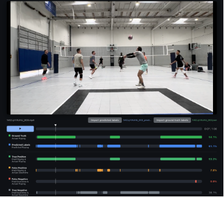
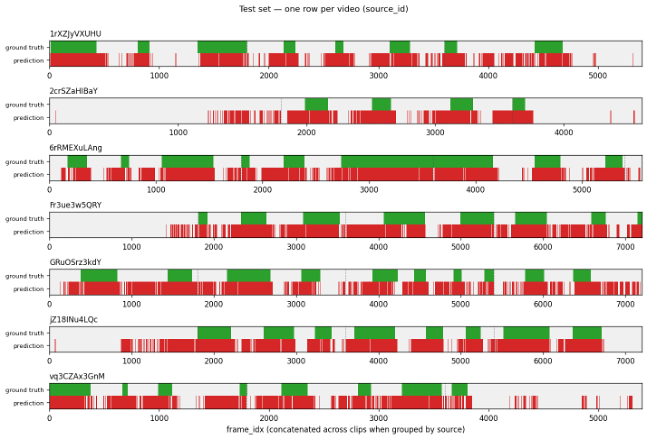
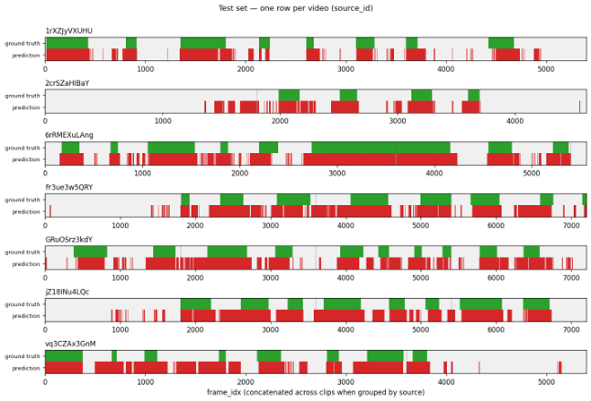
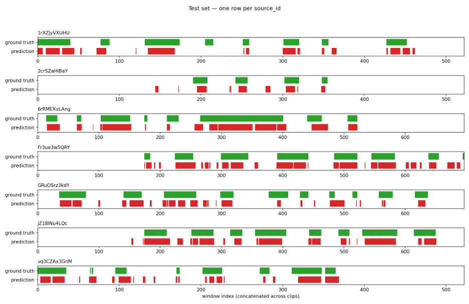
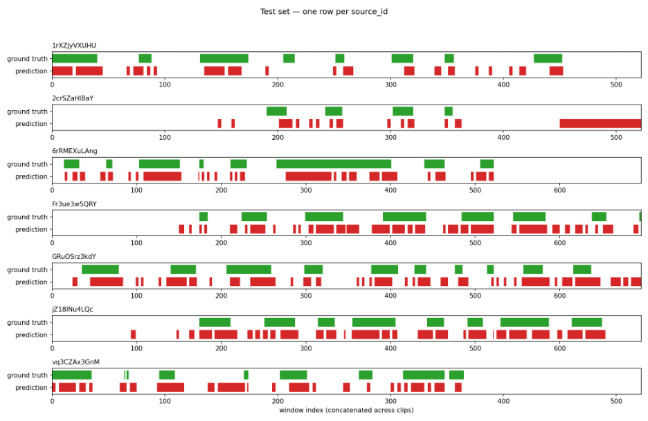
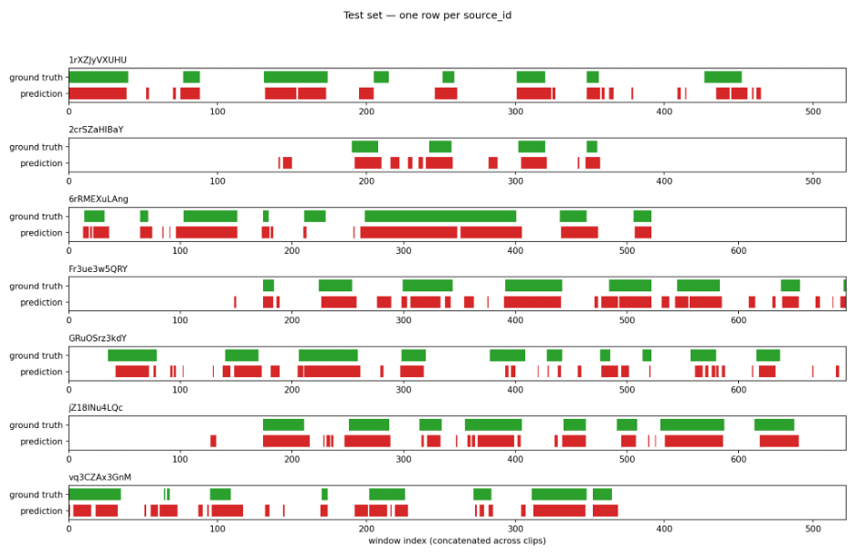

# **May 22 2026 Project Update**

## **Project Summary**

**Question:** Can an ML-based approach trim downtime in volleyball video footage with accuracy comparable to a human editor while saving substantial time?

We frame this as a binary classification task on volleyball video frames: positive \= active play, negative \= trimmable downtime. The model's output is a set of "suggested cuts" that a human editor can refine, so we prioritize high recall (don't cut active play) and tolerate some false positives (leaving some downtime uncut). See "Evaluation Strategy" in the May 8 update for full metric definitions.

**Example of ‘good’ output:** To illustrate what a good example of “cut video” would look like, an example of raw vs cut video has been put in the primary README of the repo: [https://github.com/sjrand96/sports-footage-autotrim/tree/main\#project-motivation-and-overview](https://github.com/sjrand96/sports-footage-autotrim/tree/main#project-motivation-and-overview). 

## **Progress this period**

### **Model Exploration and Results**

During this period, we explored several different model architectures to approach this video classification task. 

Our models are able to make reasonable classifications of active play vs downtime in our validation set. (For a more detailed breakdown of model performance and scores, see the “Model Results and Evaluation Metrics” section below). A sample prediction of one of our models is shown below:  

The model architectures we experimented with are summarized below:

* **Gradient Boosted Decision Trees with hand-engineered features only (Spencer):** We trained a pooled XGBoost classifier on hand-engineered features with Fβ=2-driven threshold tuning (fixed cutoff 0.24) to prioritize recall on held-out test clips (F2 ≈ 0.81, recall ≈ 0.95). FPS sensitivity and a simple always-playing baseline show the model clearly beats a naive recall-max reference and stays stable down to about 5 FPS before degrading at very low FPS rates.  
* **CNN+LSTM Model with only frame data and no hand-engineered features (Kory)**: We also wanted to explore models that rely solely on raw video frame data, without hand engineered features. We passed raw video frames through a pretrained CNN for spatial encoding, followed by an LSTM using a 1-second (30-frame) context window to capture temporal dependencies. This CNN+LSTM architecture achieved solid results, achieving 0.95 recall, \~0.59 precision, and an 0.847 F2 score on the validation set.  
* **Transformer Based Model (Raina):** We also explored Transformer-based sequence models for play/downtime detection, using the same overall goal as the CNN+LSTM track: predicting gameplay directly from temporal visual context, with and without handcrafted features. The Transformer models operate on 2-4 second sliding windows with a 1-second stride, where each window is sampled or padded to a 16-step sequence before classification. This keeps the setup comparable to the CNN+LSTM’s window-based temporal modeling, while using self-attention instead of recurrent layers.  
  * We tested three Transformer input settings: handcrafted E2E features only, frozen ResNet-18 frame embeddings only, and early fusion of ResNet-18 embeddings plus handcrafted features. Each sequence was projected into a Transformer encoder and classified as play or downtime. For comparison to the frame-level baselines, window predictions were mapped back to 30 FPS frame labels using center-window assignment.  
  * The handcrafted-features-only Transformer was the weakest variant, reaching F2 ≈ 0.711. The frames-only Transformer improved precision substantially, with precision ≈ 0.811 and F2 ≈ 0.774, but missed more play frames than desired. The best Transformer was the early-fusion model, which combined visual and handcrafted inputs and achieved precision ≈ 0.787, recall ≈ 0.864, and F2 ≈ 0.847. This matches the CNN+LSTM F2 while providing a more modular Transformer-based sequence modeling alternative.

### **Model Results and Evaluation Metrics**

We established a **baseline** approach of keeping every single frame (which matches what most players do today when handling volleyball footage \- they simply don’t bother cutting it at all). The baseline approach trivially achieves a recall of 1.0, with a low precision of 0.34. 

We benchmarked all of our models using the **F2 score** (a variant of F1 score that weights recall twice as much as precision, to align with our goal of avoiding cutting out active play). The table below summarizes confusion matrix counts, F2 score, for each model evaluated to date. 

| Model | TP | FP | FN | TN | Precision | Recall | F2 Score | Inference (FPS) |
| --- | ---: | ---: | ---: | ---: | ---: | ---: | ---: | ---: |
| Baseline (keep everything) | 14,422 | 28,143 | 0 | 0 | 0.34 | 1.00 | 0.72 | — |
| XGBoost (handcrafted features) | 13,712 | 13,024 | 710 | 15,119 | 0.51 | 0.95 | 0.81 | — |
| CNN+LSTM (frames only / no handcrafted features) | 13,698 | 9,463 | 724 | 18,680 | 0.591 | 0.950 | 0.847 | — |
| Transformer (handcrafted features only) | 10,530 | 5,795 | 3,892 | 22,348 | 0.645 | 0.730 | 0.711 | — |
| Transformer (frames only / no handcrafted features) | 11,032 | 2,567 | 3,390 | 25,576 | 0.811 | 0.765 | 0.774 | — |
| Transformer (frames + handcrafted features / early fusion) | 12,457 | 3,374 | 1,965 | 24,769 | 0.787 | 0.864 | 0.847 | — |

Almost all of our models were able to outperform the baseline approach in terms of F2 score.

### **Feature Extraction and Exploration**

* **Handcrafted feature extraction:** We built and deployed a versioned pose-and-homography feature pipeline (Docker \+ ECS Fargate fan-out) after local full-FPS extraction proved too slow (\~25 hours for the labeled set). We finished court homography for the remaining sources, completed a full run over 127 pipeline-ready clips (102 train / 25 test at a placeholder random split), and published frame-level parquets plus run metadata to S3 for downstream use.  
* **Evaluation tooling:** For internal model review, we added a small plotting utility that renders ground-truth vs. predicted playing timelines across the held-out test set—useful for quick regression checks without opening every clip. For hands-on review and demos, the standalone video editor loads local footage, compares labels to predictions (including per-frame error categories), lets you adjust trim intervals and preview “playing only,” and export edited gameplay-only video. The editor is the user-facing path toward real trims; the plot utility stays on the research side.  
* **Dataset / annotations:** We now have 8 sources ingested (148 clips total in Supabase), with 127 clips timeline-labeled for Playing/Downtime and 127 pipeline-ready (timeline \+ court homography per source). This period we closed the homography gap on the last timeline-only sources, so the full extract run covers 7 sources / 127 clips (\~102 train / 25 test at the placeholder split); data\_labeling/labeling\_inventory.py prints live coverage for the team.

### **FPS ablation: XGBoost model**

One advantage of the handcrafted-feature pipeline is that we can trade inference cost for accuracy by subsampling frames before running the upstream feature extractors (pose, detection, tracking). The chart below shows frame-level F2 vs. effective extract/inference FPS for the XGBoost classifier (fixed decision threshold 0.24, same held-out test clips; each point retrains on subsampled train frames).

Frame-level F2 stays flat from \*\*30 down to 5 FPS\*\* (\~0.81), then falls at \*\*2 FPS\*\* (\~0.80), \*\*1 FPS\*\* (\~0.79), and \*\*0.5 FPS\*\* (\~0.76); the elbow is around \*\*2 FPS\*\*, where recall starts to slip (\~0.95 → \~0.94 at 5 FPS, \~0.92 at 2 FPS, \~0.85 at 0.5 FPS) while precision inches up. For a deployment story we’d target \*\*10–15 FPS\*\* extract (roughly 2× upstream savings vs. full rate with negligible F2 loss) or \*\*5 FPS\*\* if we need a more aggressive cost cut and can accept a small recall hit. We have not yet run segment-level F2 in this ablation, so boundary/segment quality at low FPS is still an open check beyond these frame metrics.

| Effective FPS | Precision | Recall | F2 Score |
| ---: | ---: | ---: | ---: |
| 30 | 0.51 | 0.95 | 0.81 |
| 15 | 0.51 | 0.95 | 0.81 |
| 10 | 0.51 | 0.95 | 0.81 |
| 5 | 0.52 | 0.94 | 0.81 |
| 2 | 0.52 | 0.92 | 0.80 |
| 1 | 0.53 | 0.90 | 0.79 |
| 0.5 | 0.54 | 0.85 | 0.76 |

### **Model Visualization against ground truth**

We’ve standardized model outputs as a per-frame test table (clip, timestamp, ground-truth label, predicted label, and score) so different classifiers can be compared on the same held-out clips. Evaluation visuals follow a single layout: stacked timeline strips per clip or per source, with ground truth and predictions aligned frame-by-frame for quick scanning of matches and systematic errors. The example below is from our current XGBoost run; the same format will support side-by-side comparison as we add teammates’ models, and later we can extend it to show pre- and post-processing stages (e.g., smoothing or segment rules) without changing the underlying export contract. An example of this can be seen below. 

Here are the equivalent results for the CNN+LSTM model architecture:  

For Transformer architecture with frames only:
  

For Transformer architecture with features only:  

For Transformer architecture with frames and features (early fusion):  

## **Future work: Postprocessor and segment-level F2**

Frame-level F2 doesn't capture flickering or jagged segment boundaries, both of which are bad for an editor working from our suggested cuts. To address this, we plan to build a postprocessor that takes raw frame predictions, smooths them (e.g., a short majority-vote or morphological close to suppress single-frame flicker), and adds a small buffer at the start and end of each predicted play segment so we don't clip the first or last frame of a rally. The postprocessor sits between the classifier and the evaluation step and is shared across all three models.

We'll then report F2 in two regimes: before (raw per-frame predictions) and after (postprocessed predictions scored at the segment level, where predicted and ground-truth segments are matched by temporal IoU). Comparing the two isolates how much of each model's headline score depends on the postprocessor doing cleanup vs. the classifier producing clean predictions on its own and tells us whether the postprocessor is worth the added complexity at inference time.

## **Planned work for next 2 weeks**

Over the next two weeks, our main goal is to push Fβ/F2 higher while preserving high recall, since the most important failure mode is accidentally cutting active play. We plan to iterate on the strongest current models, especially the early-fusion Transformer and CNN+LSTM, by tuning thresholds, adding postprocessing/smoothing, and testing whether segment-level scoring improves after adding buffers around predicted play intervals.

We also plan to expand and clean up the labeled dataset. Additional timeline labels should help reduce false negatives in ambiguous clips and give us a more reliable held-out split. In parallel, we will continue comparing handcrafted-only, frame-only, and fused models to understand whether future gains are more likely to come from better visual modeling, better feature extraction, or better label coverage.

Finally, we want to report practical inference speed and usability. This includes measuring model/runtime FPS on real hardware, estimating end-to-end processing time per match, and checking how usable the predicted cuts are in the video editor. The goal is not only to improve metric scores, but also to determine whether the pipeline can realistically support fast review and editing on real volleyball footage.
