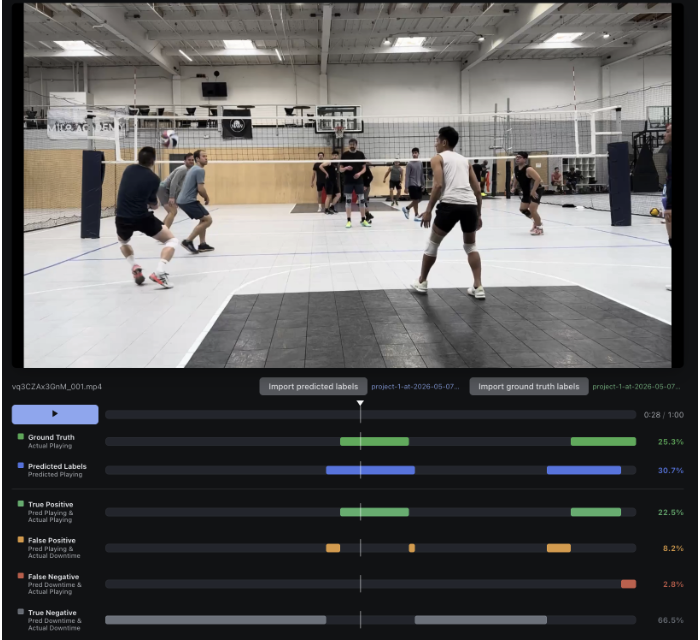

# May 8 2026 Project Update

## Project Summary

**Question:** Can an ML-based approach trim downtime in volleyball video footage with accuracy comparable to a human editor while saving substantial time?

We frame this video trimming problem as a binary classification task on volleyball video frames, where the positive class indicates active play (Playing = true) and the negative class indicates downtime that can be trimmed out.

**Project Goal:** Our primary design goal is to produce a model that can identify video segments containing actual play. For the video frames that are identified as downtime, this output will act as a set of "suggested cuts" for a human editor, to trim out the downtime from the raw video.

A human editor starting from our model's trimmed video output should be able to get a decently cut video with as few corrections as possible. Our model must strive to avoid false negatives (cutting active play), but can tolerate some false positives (leaving some downtime uncut).

To see which metrics will be used to evaluate the effectiveness of our models, see the section "Evaluation Strategy" below.

## Experiments

### Baseline Methods

Due to the time intensive nature of video editing, as of today, most players do not cut their raw volleyball video footage at all. There are no real existing baseline methods for cutting video to compare against.

However, exploring some simple, rule-based methods for cutting inactive frames will inform us which features might be useful at the training stage, and what failure modes these features may run into. We plan on implementing a baseline approach by using optical flow features between neighboring frames, and labelling a frame as active if a certain motion threshold is reached.

### Feature Extraction Based Neural Network Model

The next level of method is closer to the state-of-the art approach, which is to use feature extractors such as pose estimators, activity heuristics, and other conventional computer vision methods to extract feature data on a per frame basis. These features are then fed into a neural network along with the correct values of playing/not playing for that frame, and the network is trained. We will execute this method (which we expect to be quite accurate but also quite slow and compute intensive) to get our second level method.

### Input Frame Only Model

Our final approach is feature-guided training with image-only inference: we use structured signals like pose, motion, and detections (from the previous process) during training to guide the model toward better temporal representations, but at inference time the model classifies from raw image or video input alone. This follows prior work showing that privileged modalities (optical flow, pose, etc.) can enrich training while the deployed model uses only RGB. Concretely, we lean toward a transformer-based temporal classifier that ingests embeddings from a pretrained feature extractor over a sequence of frames, with auxiliary feature supervision available at training time only. The motivation is practical: a full multi-stage pipeline at deployment would be slow and fragile on casual hobbyist footage, so we want the training-time benefits of structured cues without the inference-time cost.

## Evaluation Strategy

We will evaluate our models based on four metrics:

- **Recall:** The model must successfully identify and keep nearly 100% of the active play frames. The recall must be close to or near 1.
- **Precision:** Today, most players do not cut their videos at all. This corresponds to maximum recall, since all active play (positive) frames are preserved. To evaluate our models by how efficiently they can cut downtime, we can compare models by seeing which one achieves the highest precision, which indicates which model does the best job at identifying active play (maximizing true positives) while including as little downtime as possible (minimizing false positives).
- **Segment-level quality:** Recall and precision are framewise metrics, but prior work on temporally structured video tasks shows that a model can achieve decent frame-level performance while still over-segmenting, flickering between labels, or producing poor temporal boundaries. To capture this, we will also report segment F1, which matches predicted segments to ground truth segments by temporal overlap and penalizes both missed rallies and spurious extra ones, and edit score, which compares the sequence of predicted segments to the ground truth sequence and specifically penalizes flickering between labels.
- **Compute time efficiency:** The model must run efficiently on consumer hardware available to recreational players. We will measure inference throughput (e.g., frames processed per second) on a typical consumer GPU or CPU, since a model that requires datacenter-scale compute to process a single match is not practical for the hobbyist use case, regardless of its accuracy.

Ultimately, a successful model will maximize recall without sacrificing the precision required to save the editor time, produce clean temporal segments rather than flickering predictions, and remain fast enough to run on the kind of hardware a recreational player is likely to have.

### Evaluation Tools

Aside from just outputting the confusion matrices, precision, and recall for every model's predictions, we would also like an interface to view which frames fall into each category of the confusion matrix in a video. This will provide us with the ability to identify common failure modes in our models.

We have written an evaluation tool that will visualize the confusion matrices for a set of predictions and ground truth labels on a specific video (see image below). The code is here: https://github.com/sjrand96/sports-footage-autotrim/pull/1

We plan on expanding the video evaluation interface further:

- Add an editing interface that gives the user the ability to make adjustments to the model's suggested video cuts, and export the trimmed video.
- Add a dashboard / metrics view that can show the overall metrics of a list of videos in aggregate, instead of a single video-level view.
- Add reporting on the processing time necessary to process the clip on consumer grade hardware.
- Add ability to plot progress on precision/recall and inference time as we make improvements to our image pipeline, algorithms, volume of labelled data, etc.

## Progress this week

- Configured necessary infrastructure including GitHub repo, Label Studio, S3, Supabase, Weights and Biases and set up environments and collaboration.
- Secured a dataset of roughly 100 hours of volleyball footage we have the rights to use.
- Annotated 60 1-minute clips and got their annotations into our database.
- Wrote the staged CV pipeline spec including frame extraction, court calibration, detection + pose, tracking, per-frame and windowed features, classifier, with per-stage benchmarks and a Parquet-cache contract between phases so the four of us can work in parallel.
- Built and validated court calibration end-to-end: annotated keypoints in Label Studio, and have a working homography fit + interactive camera to top-down tool (`cv-pipeline/calibration/court_homography.py`, `court_homography_interactive.py`).
- Started the pose-detection track with YOLOv8-pose: scripts for pulling clips from S3, running pose, and rendering side-by-side video with court top-down projection (`pose-detection/pose_side_by_side_video.py`, `foot_topdown_experiment.py`) — currently ad-hoc, will graduate into the Phase 2 cache once schemas are locked.
- Created preliminary Weights and Biases dashboard infrastructure for RGB only model.
- Built a standalone video editor (Electron + React/Vite, on `feature/video-editor`) for reviewing and trimming clips: load a local video, scrub a playback timeline, draw/drag interval handles, and a "play selected only" mode that gates the `<video>` element to the highlighted segments. Extended this with a second timeline for ground-truth vs. predicted labels and a confusion-matrix view driven by imported frame labels, so we can visually QA classifier output against annotations.